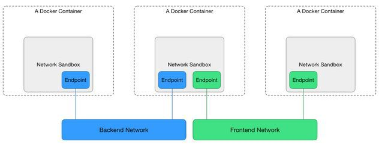

# Bridge Networking Deep Dive

The bridge network represents the docker0 network present in all Docker installations. Unless you specify otherwise with the `docker run --network=<NETWORK>` option, the Docker daemon connects containers to this network by default.

There are four important concepts about bridged networking:

* Docker0 Bridge
* Network Namespace
* Veth Pair
* External Communication

## Docker0 bridge

Docker version for this lab:

```sh
[vagrant@docker-host hello-world]$ docker version
Client: Docker Engine - Community
 Version:           19.03.13
 API version:       1.40
 Go version:        go1.13.15
 Git commit:        4484c46d9d
 Built:             Wed Sep 16 17:03:45 2020
 OS/Arch:           linux/amd64
 Experimental:      false

Server: Docker Engine - Community
 Engine:
  Version:          19.03.13
  API version:      1.40 (minimum version 1.12)
  Go version:       go1.13.15
  Git commit:       4484c46d9d
  Built:            Wed Sep 16 17:02:21 2020
  OS/Arch:          linux/amd64
  Experimental:     false
 containerd:
  Version:          1.3.7
  GitCommit:        8fba4e9a7d01810a393d5d25a3621dc101981175
 runc:
  Version:          1.0.0-rc10
  GitCommit:        dc9208a3303feef5b3839f4323d9beb36df0a9dd
 docker-init:
  Version:          0.18.0
  GitCommit:        fec3683

```

Through `docker network` command we can get more details about the docker0 bridge, and from the output, we can see there is no Container connected with the bridge now.

```sh
docker network ls
```

Output:

```sh
[vagrant@docker-host hello-world]$ docker network ls
NETWORK ID          NAME                DRIVER              SCOPE
81895eac88f6        bridge              bridge              local
115594872e39        host                host                local
b9ec37c530f2        none                null                local
```

```sh
docker network inspect 81895eac88f6
```

Output:

```sh
[vagrant@docker-host hello-world]$ docker network inspect 81895eac88f6
[
    {
        "Name": "bridge",
        "Id": "81895eac88f61365e6f3dc1606e4b0f5a48e3489a51acffd1b36c01edcb40073",
        "Created": "2020-10-28T16:31:50.679789334Z",
        "Scope": "local",
        "Driver": "bridge",
        "EnableIPv6": false,
        "IPAM": {
            "Driver": "default",
            "Options": null,
            "Config": [
                {
                    "Subnet": "172.17.0.0/16"
                }
            ]
        },
        "Internal": false,
        "Attachable": false,
        "Ingress": false,
        "ConfigFrom": {
            "Network": ""
        },
        "ConfigOnly": false,
        "Containers": {
            "26cfddf939de945e2e954d4d9dcc3a8e6825762ca05b0ea7043e42524b5536de": {
                "Name": "demo",
                "EndpointID": "785a09fa224666d88db28e7051d84309d1957ca5bce202579ab16bf3970a7d3d",
                "MacAddress": "02:42:ac:11:00:02",
                "IPv4Address": "172.17.0.2/16",
                "IPv6Address": ""
            }
        },
        "Options": {
            "com.docker.network.bridge.default_bridge": "true",
            "com.docker.network.bridge.enable_icc": "true",
            "com.docker.network.bridge.enable_ip_masquerade": "true",
            "com.docker.network.bridge.host_binding_ipv4": "0.0.0.0",
            "com.docker.network.bridge.name": "docker0",
            "com.docker.network.driver.mtu": "1500"
        },
        "Labels": {}
    }
]
```

You can also see this bridge as a part of a host’s network stack by using the ifconfig/ip command on the host.

```sh
[vagrant@docker-host hello-world]$ ip link
1: lo: <LOOPBACK,UP,LOWER_UP> mtu 65536 qdisc noqueue state UNKNOWN mode DEFAULT group default qlen 1000
    link/loopback 00:00:00:00:00:00 brd 00:00:00:00:00:00
2: eth0: <BROADCAST,MULTICAST,UP,LOWER_UP> mtu 1500 qdisc pfifo_fast state UP mode DEFAULT group default qlen 1000
    link/ether 52:54:00:4d:77:d3 brd ff:ff:ff:ff:ff:ff
3: eth1: <BROADCAST,MULTICAST,UP,LOWER_UP> mtu 1500 qdisc pfifo_fast state UP mode DEFAULT group default qlen 1000
    link/ether 08:00:27:0d:96:53 brd ff:ff:ff:ff:ff:ff
4: docker0: <BROADCAST,MULTICAST,UP,LOWER_UP> mtu 1500 qdisc noqueue state UP mode DEFAULT group default 
    link/ether 02:42:c5:4a:26:52 brd ff:ff:ff:ff:ff:ff
10: veth8a3ecaf@if9: <BROADCAST,MULTICAST,UP,LOWER_UP> mtu 1500 qdisc noqueue master docker0 state UP mode DEFAULT group default 
    link/ether 72:80:d7:94:cb:09 brd ff:ff:ff:ff:ff:ff link-netnsid 0
14: veth-a@if13: <BROADCAST,MULTICAST,UP,LOWER_UP> mtu 1500 qdisc noqueue state UP mode DEFAULT group default qlen 1000
    link/ether 72:e4:36:73:27:42 brd ff:ff:ff:ff:ff:ff link-netnsid 1
```

Because there are no containers running, the bridge `docker0` status is down.

Install `bridge-utils` package.
sudo yum install bridge-utils

You can also use `brctl` command to get bridge `docker0` information

```sh
brctl show
```

Output:

```sh
[vagrant@docker-host hello-world]$ brctl show
bridge name    bridge id            STP enabled    interfaces
docker0        8000.0242c54a2652    no             veth8a3ecaf
```

## Veth Pair

Now we create and run a centos7 container:

```sh
docker run -d --name test1 centos:7 /bin/bash -c "while true; do sleep 3600; done"
docker ps
```

Output:

```sh
[vagrant@docker-host hello-world]$ docker run -d --name test1 centos:7 /bin/bash -c "while true; do sleep 3600; done"

[vagrant@docker-host hello-world]$ docker ps
CONTAINER ID        IMAGE                   COMMAND                  CREATED              STATUS              PORTS               NAMES
ae73a290c5b6        centos:7                "/bin/bash -c 'while…"   About a minute ago   Up About a minute                       test1
```

After that we can check the ip interface in the docker host.

```sh
[vagrant@docker-host hello-world]$ ip link
1: lo: <LOOPBACK,UP,LOWER_UP> mtu 65536 qdisc noqueue state UNKNOWN mode DEFAULT group default qlen 1000
    link/loopback 00:00:00:00:00:00 brd 00:00:00:00:00:00
2: eth0: <BROADCAST,MULTICAST,UP,LOWER_UP> mtu 1500 qdisc pfifo_fast state UP mode DEFAULT group default qlen 1000
    link/ether 52:54:00:4d:77:d3 brd ff:ff:ff:ff:ff:ff
3: eth1: <BROADCAST,MULTICAST,UP,LOWER_UP> mtu 1500 qdisc pfifo_fast state UP mode DEFAULT group default qlen 1000
    link/ether 08:00:27:0d:96:53 brd ff:ff:ff:ff:ff:ff
4: docker0: <BROADCAST,MULTICAST,UP,LOWER_UP> mtu 1500 qdisc noqueue state UP mode DEFAULT group default 
    link/ether 02:42:c5:4a:26:52 brd ff:ff:ff:ff:ff:ff
10: veth8a3ecaf@if9: <BROADCAST,MULTICAST,UP,LOWER_UP> mtu 1500 qdisc noqueue master docker0 state UP mode DEFAULT group default 
    link/ether 72:80:d7:94:cb:09 brd ff:ff:ff:ff:ff:ff link-netnsid 0
14: veth-a@if13: <BROADCAST,MULTICAST,UP,LOWER_UP> mtu 1500 qdisc noqueue state UP mode DEFAULT group default qlen 1000
    link/ether 72:e4:36:73:27:42 brd ff:ff:ff:ff:ff:ff link-netnsid 1
16: vethd2e2236@if15: <BROADCAST,MULTICAST,UP,LOWER_UP> mtu 1500 qdisc noqueue master docker0 state UP mode DEFAULT group default 
    link/ether 22:2b:99:c7:0c:64 brd ff:ff:ff:ff:ff:ff link-netnsid 2
```

The bridge `docker0` is up, and there is a veth pair created, one is in localhost, and another is in container’s network namspace.

## Network Namespace

If we add a new network namespace from command line.

```sh
sudo ip netns add demo
ip netns list
ls /var/run/netns
sudo ip netns exec demo ip a
```

Output:

```sh
[vagrant@docker-host hello-world]$ sudo ip netns add demo
[vagrant@docker-host hello-world]$ 
[vagrant@docker-host hello-world]$ ip netns list
demo
test1 (id: 1)
[vagrant@docker-host hello-world]$ ls /var/run/netns
demo  test1
[vagrant@docker-host hello-world]$ 
[vagrant@docker-host hello-world]$ sudo ip netns exec demo ip a
1: lo: <LOOPBACK> mtu 65536 qdisc noop state DOWN group default qlen 1000
    link/loopback 00:00:00:00:00:00 brd 00:00:00:00:00:00
```

But from the command `ip netns list`, we can’t get the container’s network namespace. The reason is because docker deleted all containers network namespaces information from `/var/run/netns`.

We can get all docker container network namespace from `/var/run/docker/netns`.

```sh
docker ps -a
sudo ls -l /var/run/docker/netns
```

Output:

```sh
[vagrant@docker-host hello-world]$ docker ps -a
CONTAINER ID        IMAGE               COMMAND                  CREATED             STATUS              PORTS               NAMES
ae73a290c5b6        centos:7            "/bin/bash -c 'while…"   18 minutes ago      Up 18 minutes                           test1
[vagrant@docker-host hello-world]$ sudo ls -l /var/run/docker/netns
total 0
-r--r--r--. 1 root root 0 Oct 28 20:24 12d74daa806e
```

How to get the detail information (like veth) about the container network namespace?

First we should get the pid of this container process, and get all namespaces about this container.

```sh
docker ps
```

Output:

```sh
[vagrant@docker-host hello-world]$ docker ps
CONTAINER ID        IMAGE               COMMAND                  CREATED             STATUS              PORTS               NAMES
ae73a290c5b6        centos:7            "/bin/bash -c 'while…"   21 minutes ago      Up 21 minutes                           test1
```

```sh
docker inspect --format '{{.State.Pid}}' ae73a290c5b6
```

Output:

```sh
[vagrant@docker-host hello-world]$ docker inspect --format '{{.State.Pid}}' ae73a290c5b6
4131
```

```sh
sudo ls -l /proc/4131/ns
```

Output:

```sh
[vagrant@docker-host hello-world]$ sudo ls -l /proc/4131/ns
total 0
lrwxrwxrwx. 1 root root 0 Oct 28 20:49 ipc -> ipc:[4026532328]
lrwxrwxrwx. 1 root root 0 Oct 28 20:49 mnt -> mnt:[4026532326]
lrwxrwxrwx. 1 root root 0 Oct 28 20:24 net -> net:[4026532331]
lrwxrwxrwx. 1 root root 0 Oct 28 20:49 pid -> pid:[4026532329]
lrwxrwxrwx. 1 root root 0 Oct 28 20:49 user -> user:[4026531837]
lrwxrwxrwx. 1 root root 0 Oct 28 20:49 uts -> uts:[4026532327]
```

Then restore the network namespace:

```sh
sudo ln -s /proc/4131/ns/net /var/run/netns/4131
ip netns list
sudo ip netns exec 4131 ip link
```

Output:

```sh
[vagrant@docker-host hello-world]$ sudo ln -s /proc/4131/ns/net /var/run/netns/4131
[vagrant@docker-host hello-world]$ 
[vagrant@docker-host hello-world]$ ip netns list
4131
demo
test1 (id: 1)
[vagrant@docker-host hello-world]$ sudo ip netns exec 4131 ip link
1: lo: <LOOPBACK,UP,LOWER_UP> mtu 65536 qdisc noqueue state UNKNOWN mode DEFAULT group default qlen 1000
    link/loopback 00:00:00:00:00:00 brd 00:00:00:00:00:00
15: eth0@if16: <BROADCAST,MULTICAST,UP,LOWER_UP> mtu 1500 qdisc noqueue state UP mode DEFAULT group default 
    link/ether 02:42:ac:11:00:03 brd ff:ff:ff:ff:ff:ff link-netnsid 0
```

After all is done, please remove /var/run/netns/4131.

## External Communication

All containers connected with bridge docker0 can communicate with the external network or other containers which connected with the same bridge.

Let’s start two containers:

```sh
docker run -d --name test2 centos:7 /bin/bash -c "while true; do sleep 3600; done"
docker ps
```

Output:

```sh
[vagrant@docker-host hello-world]$ docker run -d --name test2 centos:7 /bin/bash -c "while true; do sleep 3600; done"
a453d75860c2ab0467d8e765d0918bdbecca4cbe75b1199af69a926b35d757f1
[vagrant@docker-host hello-world]$ docker ps
CONTAINER ID        IMAGE               COMMAND                  CREATED             STATUS              PORTS               NAMES
a453d75860c2        centos:7            "/bin/bash -c 'while…"   9 seconds ago       Up 8 seconds                            test2
ae73a290c5b6        centos:7            "/bin/bash -c 'while…"   36 minutes ago      Up 36 minutes                           test1
```

And from the bridge `docker0`, we can see two interfaces connected.

```sh
brctl show
ip link
```

Output:

```sh
[vagrant@docker-host hello-world]$ brctl show
bridge name bridge id           STP enabled     interfaces
docker0     8000.0242c54a2652   no              veth1d09b71
                                                vethd2e2236
[vagrant@docker-host hello-world]$ ip link
1: lo: <LOOPBACK,UP,LOWER_UP> mtu 65536 qdisc noqueue state UNKNOWN mode DEFAULT group default qlen 1000
    link/loopback 00:00:00:00:00:00 brd 00:00:00:00:00:00
2: eth0: <BROADCAST,MULTICAST,UP,LOWER_UP> mtu 1500 qdisc pfifo_fast state UP mode DEFAULT group default qlen 1000
    link/ether 52:54:00:4d:77:d3 brd ff:ff:ff:ff:ff:ff
3: eth1: <BROADCAST,MULTICAST,UP,LOWER_UP> mtu 1500 qdisc pfifo_fast state UP mode DEFAULT group default qlen 1000
    link/ether 08:00:27:0d:96:53 brd ff:ff:ff:ff:ff:ff
4: docker0: <BROADCAST,MULTICAST,UP,LOWER_UP> mtu 1500 qdisc noqueue state UP mode DEFAULT group default 
    link/ether 02:42:c5:4a:26:52 brd ff:ff:ff:ff:ff:ff
14: veth-a@if13: <BROADCAST,MULTICAST,UP,LOWER_UP> mtu 1500 qdisc noqueue state UP mode DEFAULT group default qlen 1000
    link/ether 72:e4:36:73:27:42 brd ff:ff:ff:ff:ff:ff link-netnsid 1
16: vethd2e2236@if15: <BROADCAST,MULTICAST,UP,LOWER_UP> mtu 1500 qdisc noqueue master docker0 state UP mode DEFAULT group default 
    link/ether 22:2b:99:c7:0c:64 brd ff:ff:ff:ff:ff:ff link-netnsid 2
18: veth1d09b71@if17: <BROADCAST,MULTICAST,UP,LOWER_UP> mtu 1500 qdisc noqueue master docker0 state UP mode DEFAULT group default 
    link/ether ba:18:a1:8c:fa:d0 brd ff:ff:ff:ff:ff:ff link-netnsid 0
```

The two containers can be reached by each other

```sh
docker inspect --format '{{.NetworkSettings.IPAddress}}' test1
docker inspect --format '{{.NetworkSettings.IPAddress}}' test2

docker exec test1 bash -c 'ping -c4 172.17.0.2'
```

Output:

```sh
[vagrant@docker-host hello-world]$ docker inspect --format '{{.NetworkSettings.IPAddress}}' test1
172.17.0.3
[vagrant@docker-host hello-world]$ docker inspect --format '{{.NetworkSettings.IPAddress}}' test2
172.17.0.2

[vagrant@docker-host hello-world]$ docker exec test1 bash -c 'ping -c4 172.17.0.2'
PING 172.17.0.2 (172.17.0.2) 56(84) bytes of data.
64 bytes from 172.17.0.2: icmp_seq=1 ttl=64 time=0.062 ms
64 bytes from 172.17.0.2: icmp_seq=2 ttl=64 time=0.087 ms
64 bytes from 172.17.0.2: icmp_seq=3 ttl=64 time=0.089 ms
64 bytes from 172.17.0.2: icmp_seq=4 ttl=64 time=0.085 ms

--- 172.17.0.2 ping statistics ---
4 packets transmitted, 4 received, 0% packet loss, time 2997ms
rtt min/avg/max/mdev = 0.062/0.080/0.089/0.015 ms
```

The basic network would be like below:


### CNM

To understand how container get its ip address, you should understand what is CNM (Container Network Model) [2].

Libnetwork implements Container Network Model (CNM) which formalizes the steps required to provide networking for containers while providing an abstraction that can be used to support multiple network drivers.

During the Network and Endpoints lifecycle, the CNM model controls the IP address assignment for network and endpoint interfaces via the IPAM driver(s) [1].

When creating the bridge `docker0`, libnetwork will do some request to IPAM driver, something like network gateway, address pool. When creating a container, in the network sandbox, and endpoint was created, libnetwork will request an IPv4 address from the IPv4 pool and assign it to the endpoint interface IPv4 address.



### NAT

Container in bridge network mode can access the external network through `NAT` which configured by iptables.

Inside the container:

```sh
docker exec -it test1 sh

ping -c4 www.google.com
```

Output:

```sh
[vagrant@docker-host hello-world]$ docker exec -it test1 sh
sh-4.2#

sh-4.2# ping -c4 www.google.com
PING www.google.com (142.250.68.100) 56(84) bytes of data.
64 bytes from lax31s12-in-f4.1e100.net (142.250.68.100): icmp_seq=1 ttl=61 time=19.3 ms
64 bytes from lax31s12-in-f4.1e100.net (142.250.68.100): icmp_seq=2 ttl=61 time=26.5 ms
64 bytes from lax31s12-in-f4.1e100.net (142.250.68.100): icmp_seq=3 ttl=61 time=24.7 ms
64 bytes from lax31s12-in-f4.1e100.net (142.250.68.100): icmp_seq=4 ttl=61 time=17.5 ms

--- www.google.com ping statistics ---
```

From the docker host, we can see:

```sh
sudo iptables --list -t nat
```

Output:

```sh
[vagrant@docker-host hello-world]$ sudo iptables --list -t nat
Chain PREROUTING (policy ACCEPT)
target     prot opt source               destination
DOCKER     all  --  anywhere             anywhere             ADDRTYPE match dst-type LOCAL

Chain INPUT (policy ACCEPT)
target     prot opt source               destination

Chain OUTPUT (policy ACCEPT)
target     prot opt source               destination
DOCKER     all  --  anywhere            !localhost/8          ADDRTYPE match dst-type LOCAL

Chain POSTROUTING (policy ACCEPT)
target     prot opt source               destination
MASQUERADE  all  --  172.17.0.0/16        anywhere

Chain DOCKER (2 references)
target     prot opt source               destination
RETURN     all  --  anywhere             anywhere
```

For NAT with iptables, you can reference [3] [4]

Reference

[1] [https://github.com/docker/libnetwork/blob/master/docs/ipam.md)](https://github.com/docker/libnetwork/blob/master/docs/ipam.md)

[2] [https://github.com/docker/libnetwork/blob/master/docs/design.md](https://github.com/docker/libnetwork/blob/master/docs/design.md)

[3]	[http://www.karlrupp.net/en/computer/nat_tutorial](http://www.karlrupp.net/en/computer/nat_tutorial)

[4]	[https://access.redhat.com/documentation/en-US/Red_Hat_Enterprise_Linux/4/html/Security_Guide/s1-firewall-ipt-fwd.html](https://access.redhat.com/documentation/en-US/Red_Hat_Enterprise_Linux/4/html/Security_Guide/s1-firewall-ipt-fwd.html)
